# 🧠 WorkforceCLI — Employee Management System


A command-line Java application that demonstrates **Object-Oriented Programming (OOP)**, **Recursion**, and **Algorithmic Thinking** through a simulated company employee management system.  
Designed to showcase sorting, searching, and structured data handling in a clean CLI environment.

---

## ✨ Features
- Add employees manually or generate random test data  
- Department and manager class hierarchy  
- Recursive insertion sort by name  
- Binary and linear search for employee lookup  
- Input validation and clean menu-driven navigation  
- CSV export for data persistence  

---

## 🧩 Technologies
| Tool | Purpose |
|------|----------|
| **Java (JDK 17)** | Core programming language |
| **NetBeans / VS Code** | Development environment |
| **Ant** | Build automation |
| **Git & GitHub** | Version control and portfolio hosting |

---

## 📁 Project Structure
| File / Folder | Description |
|----------------|--------------|
| `Employee.java` | Defines base employee attributes and methods |
| `Manager.java` | Extends employee class with managerial fields |
| `Department.java` | Represents company departments |
| `DreamCompanyApp.java` | Main CLI entry point |
| `applicant_data.csv` | Demo dataset used for testing |
| `.gitignore` | Ignored build and IDE files |
| `README.md` | Project documentation |

---

## 🧮 Algorithms Implemented
| Algorithm | Type | Purpose |
|------------|------|----------|
| **Insertion Sort (Recursive)** | Sorting | Sort employees alphabetically by name |
| **Bubble Sort** | Sorting | Compare performance with recursion |
| **Binary Search (Iterative)** | Searching | Fast employee name lookup |
| **Linear Search** | Searching | Baseline comparison for efficiency |

---

## 🧠 Learning Highlights
- Applying **OOP concepts** (Inheritance, Polymorphism, Encapsulation)  
- Implementing **Recursive algorithms** for sorting  
- Comparing **algorithm efficiency and complexity**  
- Managing and structuring data in a CLI Java application  
- Working with **CSV I/O and validation logic**  

---

## 🧪 How to Run

### 🟣 Option 1: Using NetBeans
1. Open **NetBeans IDE**  
2. Go to **File → Open Project**  
3. Select the project folder (`WORKFORCE-CLI`)  
4. Run `DreamCompanyApp.java`  
5. Follow the on-screen menu  

---

### 🟦 Option 2: Using VS Code
1. Open **VS Code**  
2. Install the **Extension Pack for Java** (from Microsoft)  
3. Open the `WORKFORCE-CLI` folder  
4. Open `DreamCompanyApp.java`  
5. Click the ▶️ **Run** button at the top-right corner  
   or run manually via the **VS Code terminal**:
   ```bash
   javac -d bin src/workforce/*.java
   java -cp bin workforce.DreamCompanyApp

---

### 🖥️ Option 3: Using Command Line
```bash
javac -d bin src/workforce/*.java
java -cp bin workforce.DreamCompanyApp
```

---

## 📸 Screenshots/View of the CLI

### 🏠 Main Menu
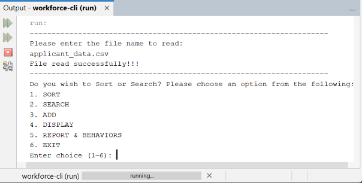

### ✍️ Add Employee
#### Add a New Employee
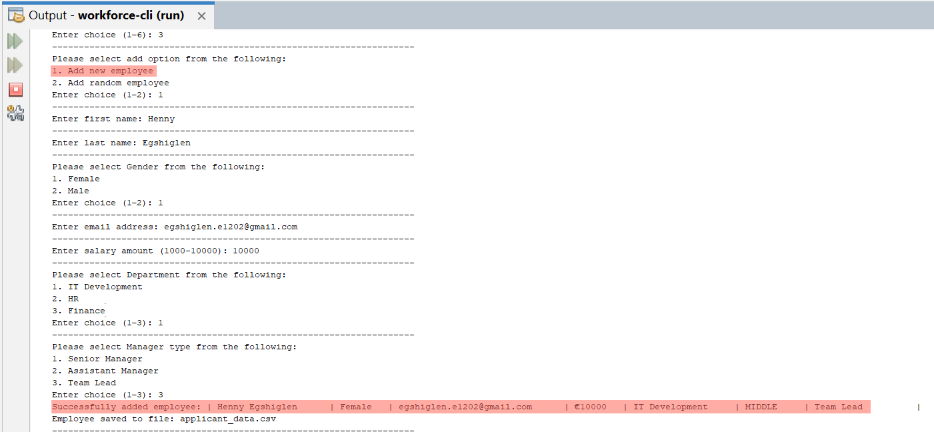
#### Add Random Employees
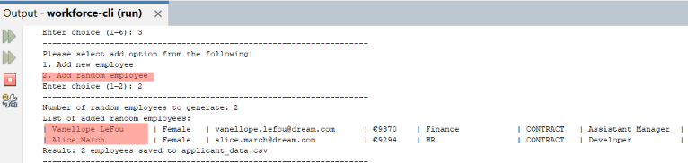

### 🔍 Search Employee
#### Search By Fullname
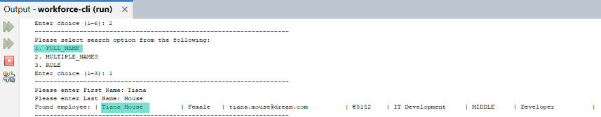
#### Search By Multiple Names
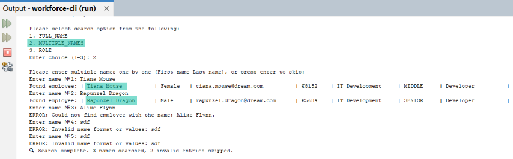
#### Search By Role
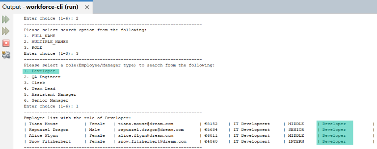

### 📋 Sorted Employee Lists
#### Sort By Name
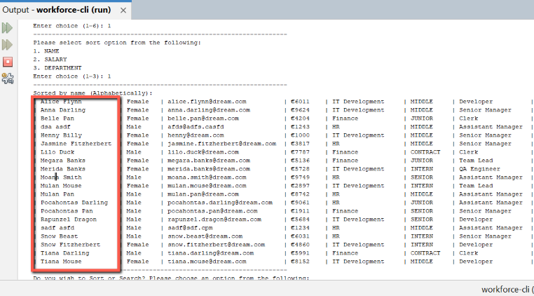
#### Sort By Salary
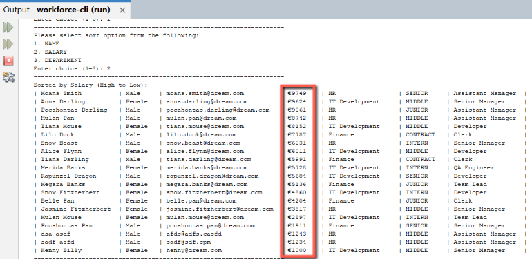
#### Sort By Department
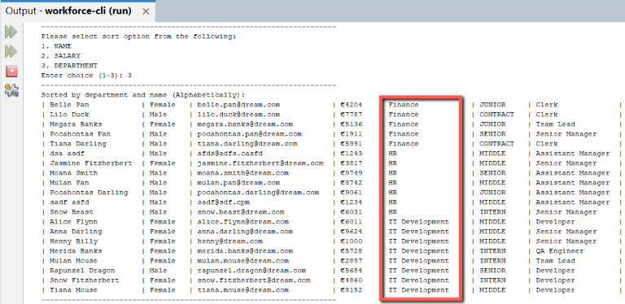

### ⚠️ Validation & Behavior
#### Validation
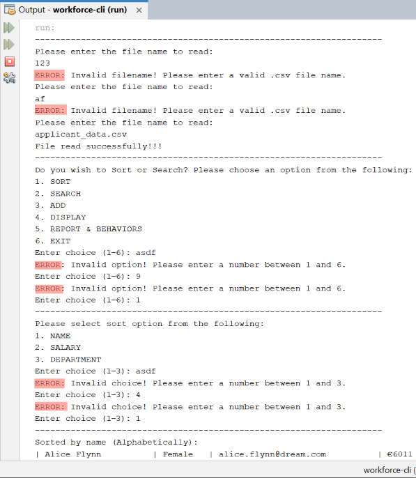
#### Report & Behavior
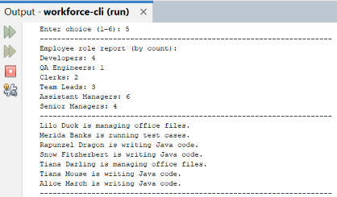

### 🧾 Display All
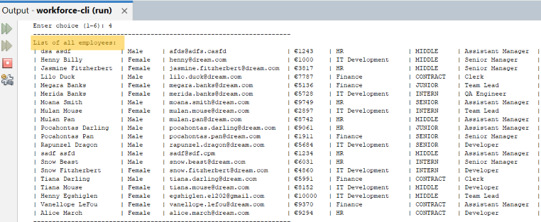


---

## 🏆 Future Improvements

- Add data filtering by department or role
- Implement JUnit tests for sorting and searching algorithms
- Add JSON import/export support
- Improve CLI visuals with color-coded menus

---

## 🧩 System Modelling & Build Report


This report documents the full **system design and UML modelling** for the **Workforce CLI Java Application** (Dream Tech System).

### 📘 Contents
- System Overview & Boundary Diagram  
- Five detailed **Use Case Narratives & Diagrams**  
- **UML Class Diagram** and **Sequence Diagrams**  
- **User Stories** and **Acceptance Criteria**  
- **Unit Testing Scenarios** linked to project source code  

📄 [**View Full Report (PDF)**](./docs/Workforce_CLI_System_Modelling_Report.pdf)


---

## 👩‍💻 Author
**Egshiglen Enkhbayar**  
📍 Dublin, Ireland  
🔗 [GitHub](https://github.com/egshiglen-henny) | [LinkedIn](https://linkedin.com/in/egshiglen)
